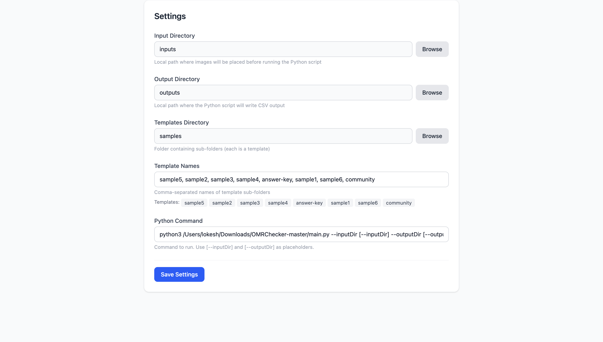
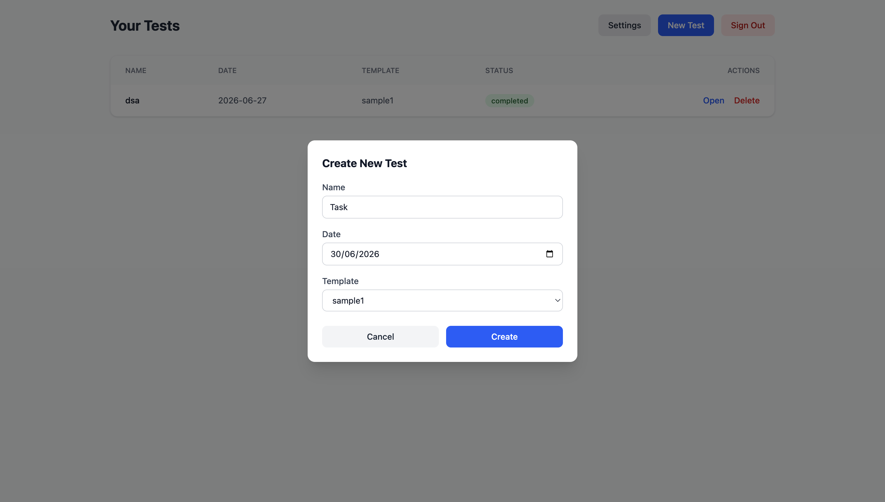
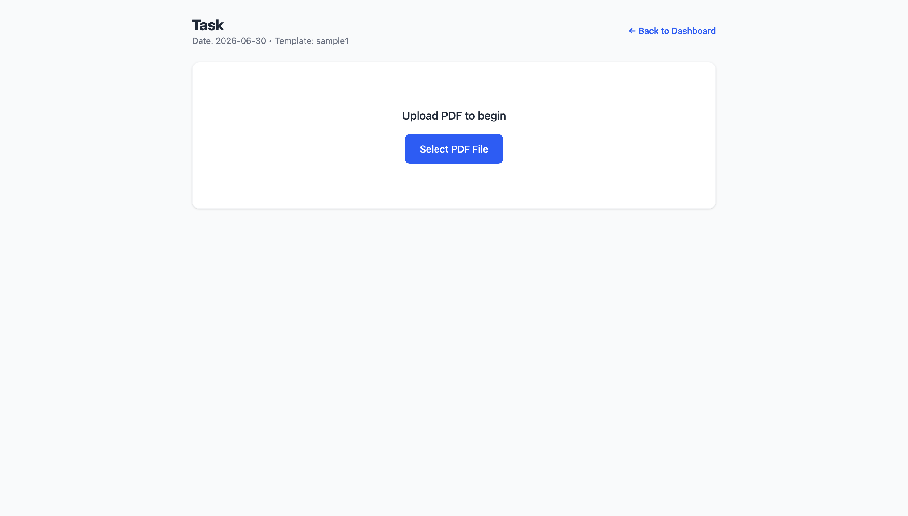
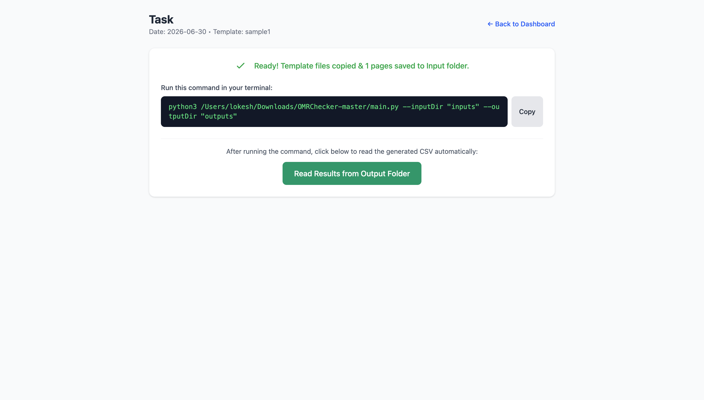
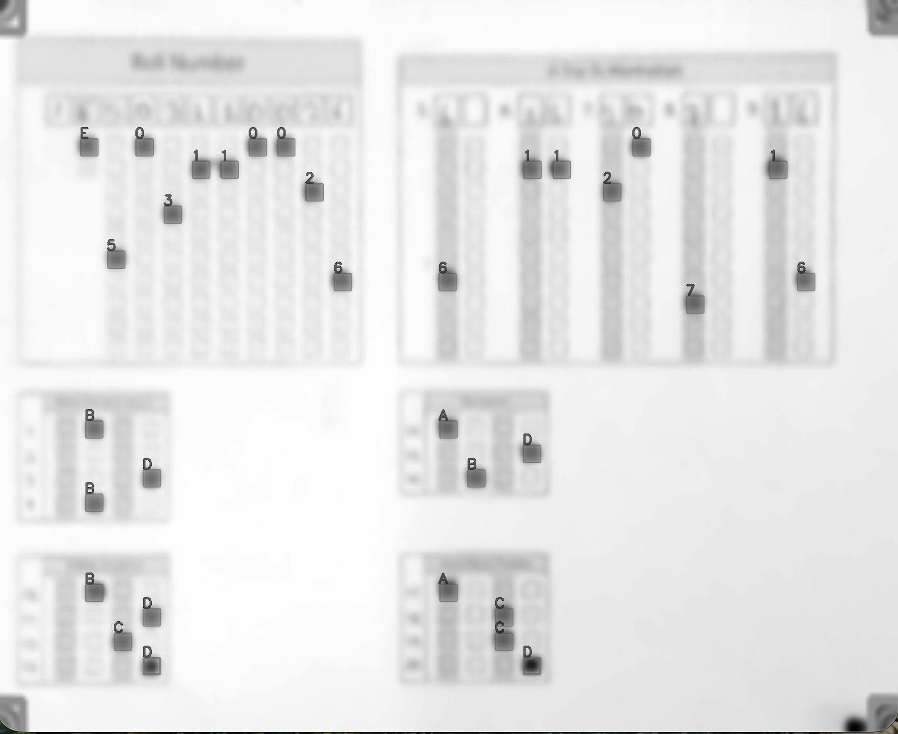

# 📄 PDF Test Manager – React + Firebase + TypeScript

A full‑featured web application for managing PDF‑to‑CSV processing workflows.  
It allows users to:

- 🔐 **Authenticate** with Google (Firebase Auth)
- 📋 **CRUD** tests (name, date, template folder)
- 📄 **Upload PDFs**, count pages, and **convert** each page to images
- 📁 **Manage folders** using the File System Access API (delete old images, copy template folders)
- 🐍 **Run a Python script** with configurable input/output directories
- 📊 **Preview** the generated CSV and **push** its data to Firestore

Built with **React 18**, **TypeScript**, **Firebase** (Auth + Firestore), and **PDF.js**.

---

## ✨ Features

- **Google Sign‑In** – secure authentication via Firebase.
- **Test CRUD** – create, read, update, delete tests with a dashboard.
- **PDF processing** – upload PDF, detect page count, convert pages to PNG images.
- **Folder management** – select input/output/templates folders; auto‑clean existing images.
- **Template system** – copy a chosen template sub‑folder into the input folder.
- **Python integration** – run a custom Python command with `--inputDir` and `--outputDir` placeholders.
- **CSV preview** – display generated CSV data in a table.
- **Firestore export** – push CSV rows to a sub‑collection for permanent storage.
- **Settings page** – configure folders and Python command.
- **TypeScript** – fully typed for better developer experience.

---

## 🚀 Prerequisites

- **Node.js** (v16 or later) and **npm** / **yarn**
- A **Firebase** project with:
  - Authentication (Google provider enabled)
  - Firestore Database (in test or production mode)
- A **Python** environment (if you intend to run the actual script)
- A modern browser that supports the **File System Access API** (Chromium‑based)

---

## 📦 Installation & Setup

### 1. Clone the repository

```bash
git clone https://github.com/your-username/pdf-test-manager.git
cd pdf-test-manager
```

### 2. Install dependencies

```bash
npm install
# or
yarn install
```

### 3. Configure Firebase

Create a `.env` file in the project root with your Firebase configuration:

```env
VITE_FIREBASE_API_KEY=your_api_key
VITE_FIREBASE_AUTH_DOMAIN=your_auth_domain
VITE_FIREBASE_PROJECT_ID=your_project_id
VITE_FIREBASE_STORAGE_BUCKET=your_storage_bucket
VITE_FIREBASE_MESSAGING_SENDER_ID=your_sender_id
VITE_FIREBASE_APP_ID=your_app_id
```

> **Note:** If you use Create React App, prefix variables with `REACT_APP_` instead of `VITE_`.

### 4. Update Firebase config

Open `src/firebase/config.ts` (or `firebase/config.ts`) and ensure it reads from `import.meta.env` (or `process.env`).

---

## 🏃 Running the Application

### Development

```bash
npm run dev
# or
npm start
```

The app will be available at `http://localhost:5173` (Vite) or `http://localhost:3000` (CRA).

### Production Build

```bash
npm run build
```

Serve the `dist` (or `build`) folder with your preferred static server.

---

## 🧩 How to Use

### 1. Sign In
- Click **“Sign in with Google”** – only authenticated users can access the app.

### 2. Configure Settings (first time)
- Go to **Settings** (⚙️).
- Select your **Input**, **Output**, and **Templates** folders using the browser’s folder picker.
- Set your Python command (e.g., `python3 main.py --inputDir [--inputDir] --outputDir [--outputDir]`).
- Save settings.

> The templates folder should contain sub‑folders, each representing a template.

### 3. Create a Test
- On the **Dashboard**, click **“New Test”**.
- Enter a **Name**, **Date**, and choose a **Template Folder** from the dropdown.
- Click **Create**.

### 4. Upload PDF & Prepare
- Open the test detail page.
- Upload a PDF file – the app counts the pages.
- Click **“Convert & Prepare”** – this will:
  1. Ask you to confirm (or re‑select) the input/output/templates folders.
  2. Delete all existing images (`.png`, `.jpg`, `.jpeg`) from input and output folders.
  3. Convert each PDF page to a PNG and save them in the input folder.
  4. Copy the chosen template folder into the input folder.

### 5. Run Python Script
- On the test detail page, click **“Run Python”**.
- The app will construct the command with the selected input/output folders and execute it (simulated in this demo; you can replace with an actual API call).
- After completion, the CSV is read from the output folder and displayed.

### 6. Push to Firestore
- Once the CSV is shown, click **“Push CSV”** to store each row as a document in a sub‑collection under the test document.

### 7. Manage Tests
- Use the Dashboard to view, open, or delete existing tests.
- Reset a test to draft state at any time.

---

## 🧪 Step-by-Step Testing Guide

Follow this visual guide to test the end-to-end PDF processing workflow.

### 1. Configure App Settings
Go to the Settings page and select your local directories. Ensure your Python command uses the exact placeholders (`[--inputDir]` and `[--outputDir]`) as shown below:


### 2. Create a New Test
Go to the Dashboard and click **New Test**. Fill in the details and choose a template (e.g., `sample1`).


### 3. Upload the PDF
Open the test you just created and click **Select PDF File** to upload your scanned OMR sheets.
*(A sample PDF is available in this repository at `docs/sample_omr.pdf` for testing purposes).*


### 4. Run the Generated Python Command
Once the PDF is converted, the app will generate a custom Python command with your specific folder paths. Copy this command and run it in your terminal.

> **Note:** If the Python script pauses to show images of its edge detection, make sure to click on the image window and press **Q** on your keyboard to let the script finish processing!

### 5. View Results
After the script finishes successfully in the terminal, click **Read Results from Output Folder** in the web app to view the generated CSV data.


---

## 🗂️ Project Structure (TypeScript)

```
src/
├── contexts/
│   ├── AuthContext.tsx          # Authentication state & methods
│   └── ToastContext.tsx         # Toast notification system
├── firebase/
│   └── config.ts                # Firebase initialization
├── pages/
│   ├── Login.tsx                # Login page
│   ├── Dashboard.tsx            # Test list & stats
│   ├── Settings.tsx             # Folder & command configuration
│   └── TestDetail.tsx           # Test workflow (upload, process, preview)
├── components/
│   ├── Navigation.tsx           # Top navigation bar
│   └── ProtectedRoute.tsx       # Route guard for authenticated users
├── types/
│   └── index.ts                 # TypeScript interfaces (Test, Settings, etc.)
├── utils/
│   ├── pdf.ts                   # PDF page counting
│   ├── fileSystem.ts            # Folder selection, deletion, copying
│   └── firestore.ts             # Firestore CRUD operations
├── App.tsx                      # Main App with routing
└── main.tsx                     # Entry point
```

---

## ⚙️ Configuration & Customisation

### Python Command Placeholders

In the **Settings** page, you can define a Python command. Use `--inputDir` and `--outputDir` as placeholders – they will be replaced with the actual folder names when the command is run.

Example:
```
python3 main.py --inputDir [--inputDir] --outputDir [--outputDir]
```

### Templates

- Templates are sub‑folders inside your **Templates Directory**.
- When creating a test, you select one of these sub‑folders.
- During the “Convert & Prepare” step, the entire template folder is copied into the input folder.

### Firestore Data Model

- **Tests** collection: each document stores test metadata (`name`, `date`, `templateFolder`, `status`, `pdfPages`, `csvData`, `csvPushed`, etc.).
- **Settings** collection: one document per user (stored under the user’s UID) containing folder names and the Python command.
- **CSV rows** are stored as separate documents in a sub‑collection: `tests/{testId}/csvRows`.

---

## 🔧 Troubleshooting

| Issue | Solution |
|-------|----------|
| **Folder picker doesn't open** | Use a Chromium‑based browser (Chrome, Edge, Brave). The File System Access API is not supported in Firefox or Safari. |
| **PDF pages not counted** | Ensure the PDF is not corrupted. The `pdf.js` library is used; check the browser console for errors. |
| **Python command does nothing** | This demo simulates execution. To actually run a Python script, you need to implement a backend API endpoint that executes the command securely. |
| **Firebase permission errors** | Update your Firestore security rules to allow reads/writes for authenticated users. |
| **Environment variables not loaded** | Prefix variables with `VITE_` (for Vite) or `REACT_APP_` (for CRA). Restart the dev server after changes. |

---

## 🤝 Contributing

Contributions are welcome! Please open an issue or submit a pull request.

1. Fork the repository.
2. Create a new branch (`git checkout -b feature/amazing-feature`).
3. Commit your changes (`git commit -m 'Add some amazing feature'`).
4. Push to the branch (`git push origin feature/amazing-feature`).
5. Open a Pull Request.

---

## 📄 License

This project is licensed under the AGPL

---

## 🙏 Acknowledgements

- [Firebase](https://firebase.google.com/) – Authentication & Firestore
- [PDF.js](https://mozilla.github.io/pdf.js/) – PDF rendering & page counting
- [Tailwind CSS](https://tailwindcss.com/) – Styling
- [Font Awesome](https://fontawesome.com/) – Icons

---

## 📬 Contact

For questions or feedback, please open an issue on GitHub.

---

**Happy PDF processing!** 📄✨